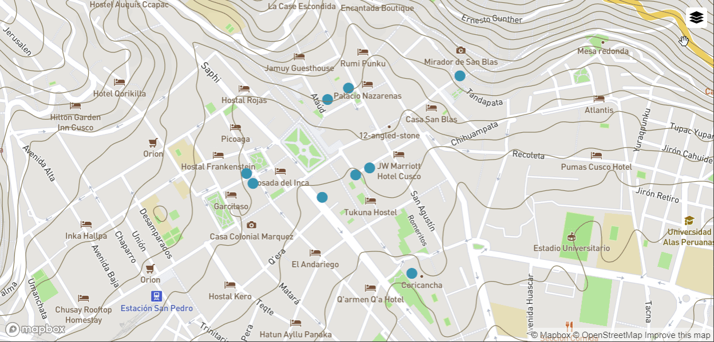
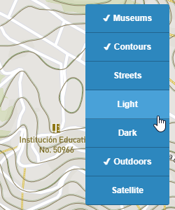
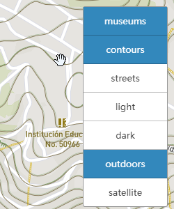
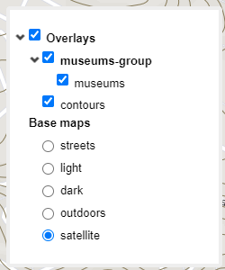

## **Mapbox** LayerSwitcher

Grouped layer list control for a [Mapbox](https://github.com/mapbox/mapbox-gl-js) map.



### install

**npm**

```
npm i mapbox-layerswitcher --save-dev
```

**cdn**

```html
<script src="./mapbox-layerswitcher.min.js"></script>
```

### Usage

```js
let layers = [
    {
        id: "museums-group",
        name: "museums-group",
        children: [
            {
                id: "museums",
                name: "museums",
            }
        ]
    },
    {
        id: "contours",
        name: "contours"
    },
    {
        id: "mapbox://styles/mapbox/streets-v11",
        name: "streets",
        type: "base"
    },
    {
        id: "mapbox://styles/mapbox/satellite-v9",
        name: "satellite",
        type: "base"
    }
];

let layerswitcher = new MapboxLayerSwitcher({
    layers: layers,
    template: 'tree1',
    activemode: 'mouseover'
});
map.addControl(layerswitcher, "top-right");
```

### Developing

**build**

```js
npm run build
```

**examples**

```js
npm run start & http://localhost:3000
```

You also need to store an access token in localstorage. Open developer tools, locate the console tab and insert:

```js
localStorage.setItem('accessToken', {your token});
```

## API

##### MapboxLayerSwitcher constructor options:

- ###### layers

  ​	We use JSON to configure layer groups and layers. We divide the layers into two types: *Basemap* and *Overlays*.

  *Basemap*

  ```json
     {
          id: "mapbox://styles/mapbox/streets-v11", // basemap's url
          name: "streets", // The name of the layer displayed on the panel
          type: "base" // The basemap must have this attribute
      }
  ```

  *Overlays*

  ```json
  {
      id: "museums-group",
      name: "museums-group",
      children: [ // Child node layer group or layer
          {
              id: "museums", 
              name: "museums",
          }
      ]
  }
  ```

- ###### template

  The following three style templates are currently available:

  |                           simple1                            |                           simple2                            |                            tree1                             |
  | :----------------------------------------------------------: | :----------------------------------------------------------: | :----------------------------------------------------------: |
  |  |  |  |

- ###### activemode

  Event to use on the button to collapse or expand the panel. Defaults to `"mouseover"`.

  Type: (`"mouseover"` | `"click"`|`"none"`).

